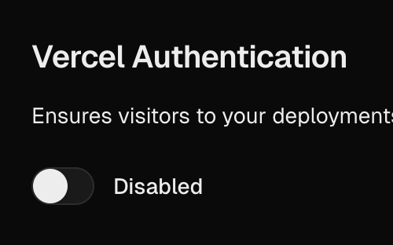

## @vercel/workflow-next

> [!TIP]
>
> **Workflow SDK** is a framework for writing and executing _durable functions_.
>
> To learn about how to write workflows, please see the [SDK docs](../core/README.md).

Next.js integration for Workflow SDK. Wraps your `next.config` to:

- Add a Turbopack/webpack loader that compiles files containing `"use workflow"`/`"use step"`
- Build the workflow and step bundles during `next build` via the Workflow CLI
- Enable the embedded transport in dev for local testing

### Installation

```bash
pnpm add @vercel/workflow-next
# or
npm i @vercel/workflow-next
# or
yarn add @vercel/workflow-next
```

### Getting Started

#### Set up your `next.config`:

Wrap your main Next.js config with the `withWorkflow()` function:

```ts
// next.config.ts
import { withWorkflow } from '@vercel/workflow-next';
import type { NextConfig } from 'next';

const nextConfig: NextConfig = {
  // … rest of your Next.js config
};

export default withWorkflow(nextConfig);
```

This will:

- Inject the `@vercel/workflow-next/loader` for both Turbopack and webpack
- Run the Workflow build as a sidecar during the `next build` process (using `@vercel/workflow-cli`)
- Adds transparent support for Workflow execution in `next dev`

#### Disable Vercel Authentication



For now, the **Vercel Authentication** feature must be _disabled_ on your Project.

> [!IMPORTANT]
>
> This is a **temporary restriction** imposed by the Vercel Queue product, which workflows relies on.

#### Disable the generated route files from your ESLint config

If you have eslint enabled for your Next.js app, you will most likely need to
explicitly disable checking of the route files that Workflow SDK produces during
the build process.

Everything in the `app/api/generated` directory should be ignored. That might look
something like this:

```diff
 // eslint.config.mjs
 import { dirname } from "path";
 import { fileURLToPath } from "url";
 import { FlatCompat } from "@eslint/eslintrc";
+import { globalIgnores } from "eslint/config";

 const __filename = fileURLToPath(import.meta.url);
 const __dirname = dirname(__filename);
 
 const compat = new FlatCompat({
 	baseDirectory: __dirname,
 });
 
 const eslintConfig = [
 	...compat.extends("next/core-web-vitals", "next/typescript"),
+	globalIgnores(["./app/api/generated"]),
 ];

 export default eslintConfig;
```

> [!NOTE]
>
> Depending on your eslint version, you might use the `.eslintignore` file instead.

#### Add your workflow

Workflow functions and step functions can be added inside the `workflows`
(or `src/workflows`, if you have src enabled) directory.

> [!TIP]
>
> To learn about how to write workflow functions, please see [Concepts](../core/docs/concepts.md).

#### Invoke your workflow

The Next.js integration generates a client-side bundle, which transparently remaps
external (i.e. from API routes or server actions) workflow function invocations into
trigger calls to the workflow to begin execution in the Workflow execution environment.

For example, in an API route, you would simply import the workflow function and invoke
in the same way that you would "normally":

```ts
import { myWorkflow } from '@/workflows/example.ts';

export const POST = (req: Request) => {

  // Enqueue the workflow to be executed.
  // (don't worry, this won't keep the request environment alive).
  myWorkflow('any', 'additional', 'arguments');

  return new Response('myWorkflow is starting!');
};
```

### Troubleshooting

- The loader only runs on files that contain `"use step"` or `"use workflow"`.
- Ensure your workflows are inside the `workflows` (or `src/workflows`, if you are using `src`) directory.
